# Cortex-M0编程入门

## 嵌入式系统编程入门

### 微控制器是如何启动的

为了保存编译好的程序代码，大多数的现代微控制器都会包含片上Flash存储器。程序代码在Flash 存储器中是以二进制机器码的形式存放的，因此C代码必须经过编译，才能烧写到Flash中。有些微控制器可能还配备了一个独立的启动ROM，里面有一个小的Boot loader 程序。微控制器启动以后，在执行Flash里的用户程序前，Boot loader会首先运行。大多数情况下，Boot loader都是固定的，只有Flash存储器中的用户程序才是可变的。

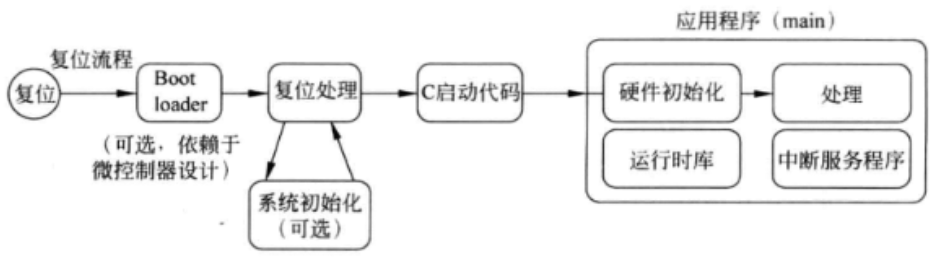

执行完C启动代码以后，应用程序就开始执行了。应用程序通常包含以下几个部分:

- 硬件初始化(如时钟、PLL和外设)
- 应用程序的处理部分
- 中断服务程序

### 嵌入式程序设计

1. 轮询

   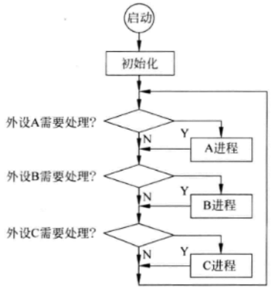

2. 中断驱动

   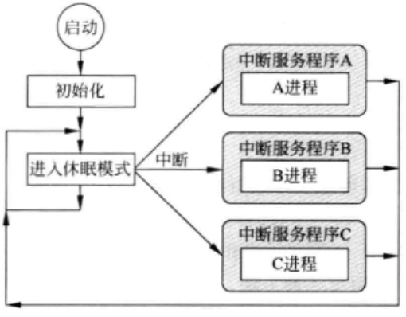

3. 轮询和中断驱动的组合使用

   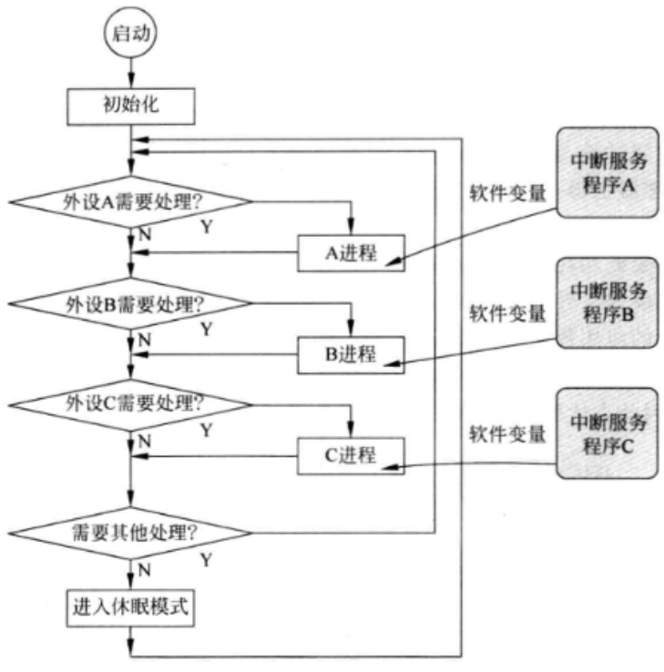

4. 处理并发任务

   有些情况下，一个处理任务可能会占用大量的时间，方法3的处理就很不合适了。可以采用将一个长时间的处理任务划分为一系列的状态，每次处理任务时，只执行一种状态的方案或使用实时操作系统(RTOS)处理多任务。

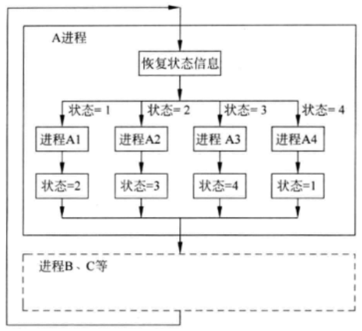

## 开发流程

- 程序生成流程

  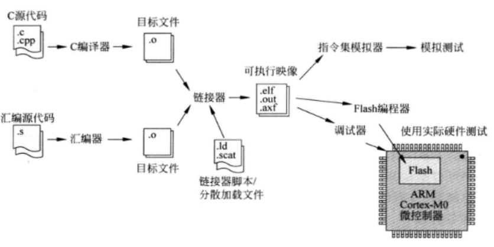

- 开发流程示例

  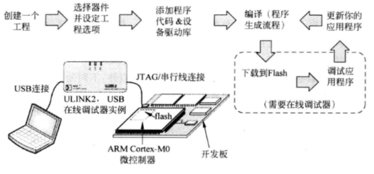

- Cortex-M0处理器调试接口的各种用途

  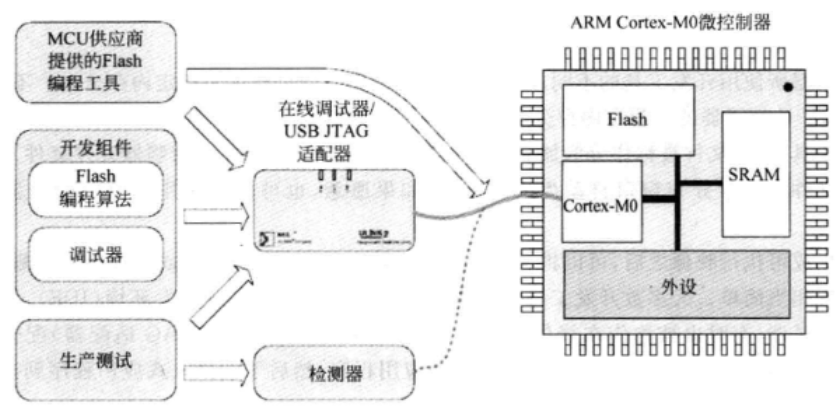

## C编程和汇编编程

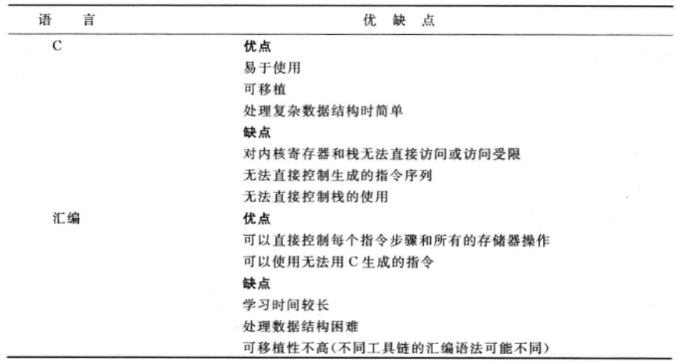

## 什么是程序映像

### 向量表

向量表可以用C语言或汇编语言实现。由于向量表的入口需要编译器和链接器生成的内容，所以向量表代码的实现细节是同开发工具链相关的。例如，栈指针的初始值被链按到链接器生成的栈空间地址，而复位向量则指向了C启动代码的地址，这些都是同编译器相关的。

### C启动例程

C启动代码用于设置像全局变量之类的数据，也会清零加载时未被初始化的内存区域对于使用malloc()等C函数的应用程序，C启动代码还需要初始化堆空间的控制变量。初始化完成后，启动代码跳转到main()程序执行。
C启动代码由编译器/链接器自动嵌入到程序中，并且是和开发工具链相关的，而只使用汇编代码编程则可能不存在C启动代码。对于ARM编译器，C启动代码被标识为“\_\_main”，而使用GNU C编译器生成的代码则通常被标记为“\_\_start”。

### 程序代码

用户指定的任务是由应用程序生成的指令完成的，除了指令以外，还有以下各类数据:

1. 变量的初始值，函数或子程序中的局部变量需要初始化，这些初始值会在程序执行期间被赋给相应的变量。
2. 程序代码中的常量，应用程序中的常量数据有多种用法，如数据值、外设寄存器的地址和常量字符串等，这些数据在程序映像中一般作为数据块放在一起，并被称作文字库。
3. 有些应用程序可能也会包括其他的常量，比如查找表和图像数据(如位图)，它们也被合并在程序映像中。

### C库代码

当使用特定的C/C++库函数时，它们的库代码就会由链接器入到程序映像中。另外，由于有些数据处理任务需要浮点数或除法运算，在进行这些运算时，C库代码也会被包含进来。Cortex-M0中没有除法指令，需要借助C函数库中的除法函数来实现除法运算。

有些开发工具提供了多个版本的 C 函数库，并且有不同的用途。例如Keil MDK和ARM RVDS可以通过选项配置，选择使用一个被称作Microlib的特殊版本C函数库Microlib体积小，专门用于微控制器，而且没有实现C标准库的全部功能。有些入式应用对数据处理能力要求不高，而且没有大的程序空间，这种情况下使用 Microlib 就可以很好地减小代码体积。

## 数据长度定义

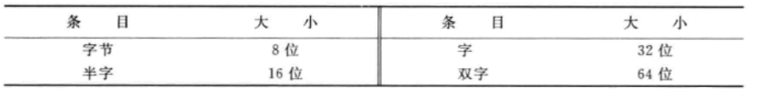

## 用C语言操作外设

除了变量以外，微控制器的C应用程序通常需要操作外设。对于ARM Cortex-M0微控制器，外设寄存器被映射到系统存储器空间，它们可以通过指针进行访问。使用微控制器供应商提供的设备驱动，可以简化开发任务，并且增强软件在不同平台间的可移植性。如果需要直接访问外设寄存器，可以使用以下方法。
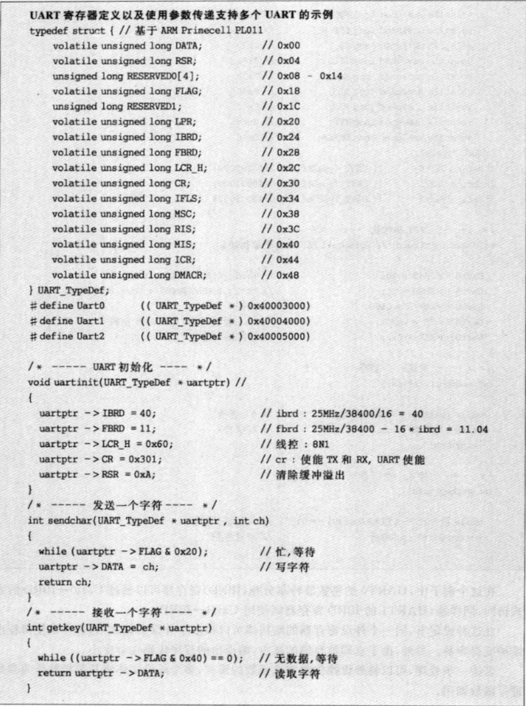

## Cortex微控制器软件接口标准(CMSIS)

为了使软件产品具有高度的兼容性和可移植性，ARM同许多微控制器供应商和软件方案供应商共同努力，开发了一个通用的软件框架CMSIS，该框架适用于大多数的Cortex-M处理器以及Cortex-M微控制器产品。

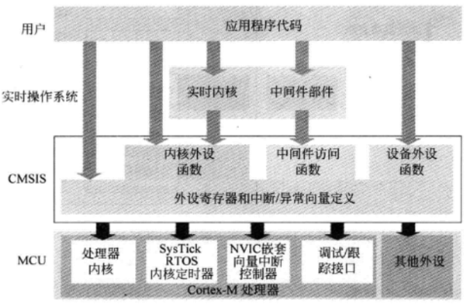

一般说来，可以在微控制器供应商提供的设备动里找到CMSIS应用的例子和信息。而OnARM网站上则有CMSIS的开发包，里面也包含了使用CMSIS的简单例子(www.onarm.com)。

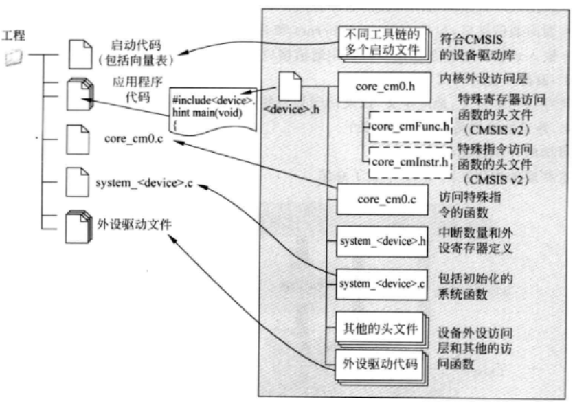

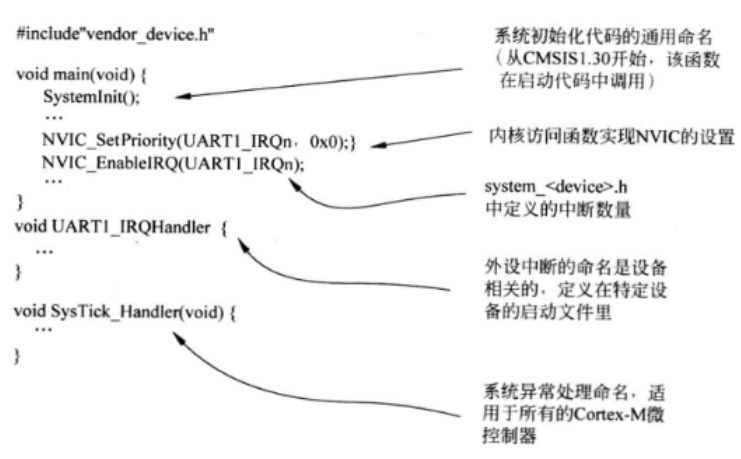

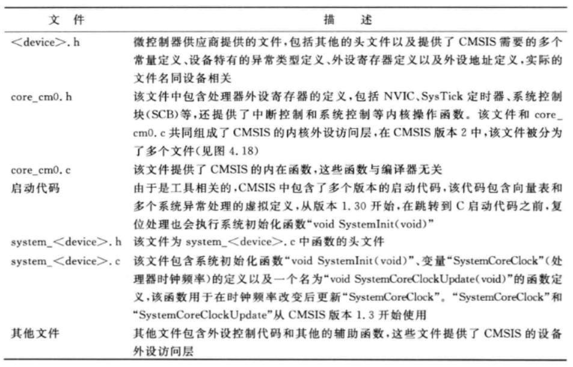
