# 体系结构

## 系统模型

### 操作模式和状态

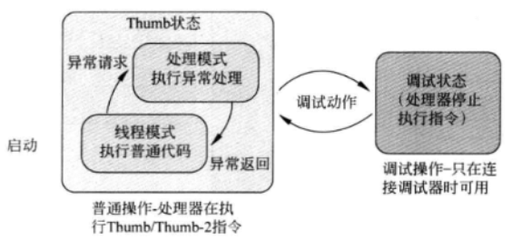

###  寄存器和特殊寄存器

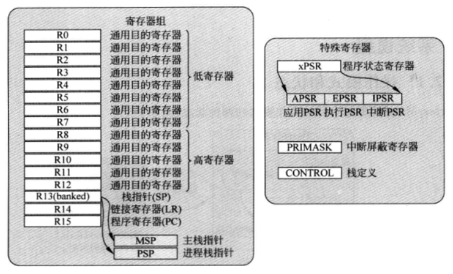

- R0-R12

  RO-R12为通用寄存器，由于16位的Thumb指令集在空间上的限制，许多Thumb指令只能操作RO到 R7，它们也被称作低存器(low registers)，而像MOV之类的一些指令则可以使用全部的寄存器。

- R13，栈指针(SP)

  R13为栈指针，用于对栈空间的存取操作(通过PUSH和POP指令)，Cortex-MO在不同的物理位置上存在两个指针。主指针(MSP，在ARM 文档中也被称作SP_main)为上电后的默认指针，用于异常处理。另外一个称作进程栈指针(PSP，在ARM文档也被称作SP_process)只能用在线程模式(Thread mode)。

  在处理器上电流程中，中断向量表的头4字节会被取出，然后填充到MSP，作为MSP的初始值。PSP的初始值未定义。PSP一般是没有必要使用的，对于许多应用，系统完全依赖MSP。使用操作系统的设计通常会用到PSP，这是因为操作系统内核的栈空间和线程级的应用程序的栈空间是相互独立的。

- R14，链接寄存器(LR)

  R14为链接寄存器，用于存储子程序或者函数调用的返回地址。子序或函数执行完毕，存储在LR中的返回地址将被装载到程序计数器(PC)中，以便调用程序可以继续执行。当发生异常中断时，LR会提供一个特定值，用于中断返回机制。
  尽管Cortex-MO处理器的函数返回地址始终是偶数(最低位为0因为最小的指令都是16位，也就是半字对齐的)，LR的0位却是可读可写的。对于ARMv6-M体系结构，为了指明当前处于Thumb状态，一些指令需要函数地址的最低位为1。

- R15，程序计数器(PC)

  R15为程序计数器，并且可读可写。读操作返回当前正在执行的指令地址加上4(这是由流水线的特性决定的)，而写入R15会导致程序跳转执行(和函数调用不同链接寄存器不会更新)。
  
  Cortex-MO处理器的指令地址须是半字(也就是 16 位)对齐的这也就意味 PC寄存器的最低位必须始终为0。不过，在使用跳转指(BX 或BLX)执行程序跳转时，PC的最低位应该被置为1，以表明目标分支处于Thumb程序区域。如果试图切换至Cortex-MO未知的ARM状态，错误异常中断就会被触发。
  
- xPSR，组合程序状态寄存器

  组合程序状态寄存器提供了程序执行信息和ALU(算术逻辑单元)标志，该寄存器由三个程序状态寄存器(PSR)组成:

  - 应用程序状态寄存器(APSR)
  - 中断程序状态寄存器(IPSR)
  - 执行程序状态寄存器(EPSR)

  APSR包含了ALU标志:N(负号标志)Z(零标志)C(进位或借位标志)和V(溢出标志)。它们位于APSR的最高4位，一般用于控制条件跳转。
  IPSR中包含了当前正在执行的中断服务程序(ISR)编号Cortex-MO的每个异常中断都会有一个特定的中断编号(表示中断类型)。这对调试时识别当前中断非常有用，而且在多个中断共用一个中断处理的情况下，可以看出发生的是哪个中断。

  Cortex-MO的EPSR包含了T位该位用以指示当前是否处于Thumb状态。由于Cortex-MO处理器只支持Thumb状态，故T位一般为1。清除该位后，执行下一条指令会触发硬件异常中断。

  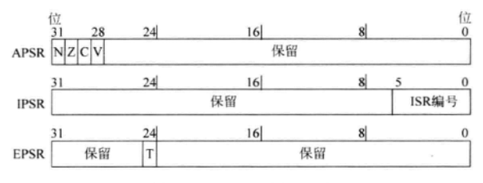
  
  这三个寄存器可以作为一个寄存器xPSR来访问。比如发生中断时，XPSR也会被自动压入栈中，从中断返回时，数据会自动恢复。在压栈和出栈的过程中，XPSR始终被当做一个寄存器。
  
  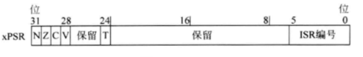
  
- PRIMASK:中断屏蔽特殊寄存器

  PRIMASK仅有一位宽，被称作中断屏寄存器，置位后除了不可屏中断(NMI)和硬件错误异常外的其他中断都会被屏蔽掉。实际上，此时当前中断优先级被置为了0，这也是可以配置的最高等级。

  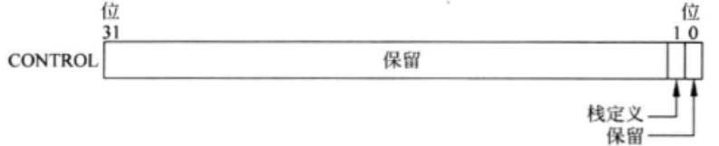

- CONTROL:特殊寄存器

  Cortex-M0处理器具有两个指针，处理器模式决定了使用的栈指针，而处理器模式依赖于CONTROL寄存器的配置。

  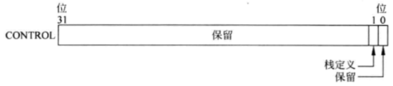

  复位以后，系统默认使用主栈指针(MSP)，在线程模式下，通过将CONTROL寄存器的第1位置1，处理器也可以切换至使用进程指针(PSP)(前提是当前不是处在异常中断处理中)。在处理异常中断时(运行在处理模式下)系统只使用MSP，CONTROL寄存器读出值为0。要改变CONTROL寄存器的值，应该在线程模式下操作，或者借助异常中断进入和返回机制。

  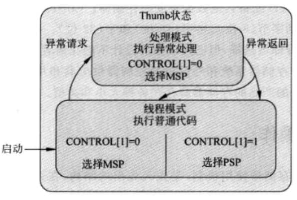

## 存储器系统

Cortex-M0处理器具有4GB的存储器地址空间。在体系结构上，存储器空间被分作一系列的区域，每个区域都有推荐的用途，以提高不同设备间的可移植性。

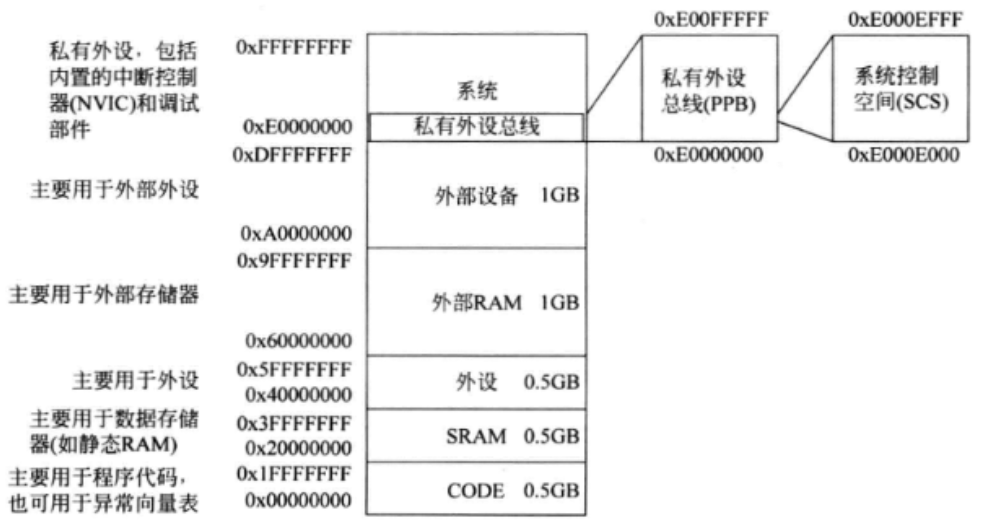

## 栈空间操作

在Cortex-MO处理器中，栈指针为R13，而且物理上存在着两个栈指针，但每次只会使用一个，这是由 CONTROL寄存器以及处理器的状态决定的。Cortex-M0处理器的栈操作基于“满递减”(fulldescending)的栈模型，这就意味着栈指针始终指向栈空间的最后一个数据，在执行数据存储前(PUSH)，栈指针会首先减小。
PUSH和POP通常用在函数或子程序的开始和结尾处。在函数开始执行时，PUSH操作将寄存器的当前内容存入栈空间。执行结束前，POP又将栈空间存储的数据恢复。一般说来，对每个寄存器的PUSH操作都应相应地进行POP操作否则复的数据可能无法对应之前的寄存器，这样会导致无法预期的后果，比如栈溢出。

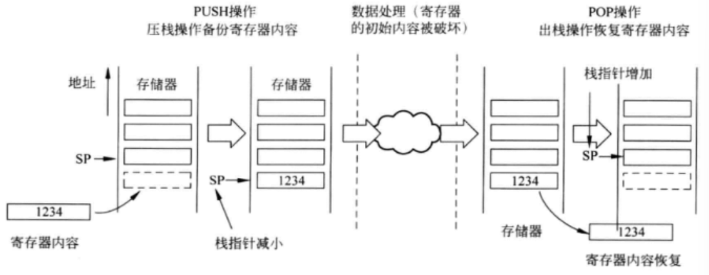

每次出栈以及压栈操作的最小单位是4字节(32位)还可以使用一条指令实现对多个寄存器的压栈和出栈操作。Cortex-M0的栈空间被设计为字对齐的(地址值必须是4的倍数，比如0x0、0x4、0x8等)，由于这个原因指针的最低两位(BITS[1:0])在硬件上被置为了0，因此读出固定为0。

在一个具有操作系统的典型嵌入式应用中，操作系统内核使用MSP而应用程序进程则使用PSP。这样就使得内核的栈空间与应用程序进程的栈空间相互独立，而操作系统的上下文切换也会非常迅速(在应用程序进程间相互切换)。即便操作系统内核只使用MSP作为其栈指针，它也可以通过特殊寄存器操作指令(MRS和MSR)访问PSP寄存器。

## 异常和中断

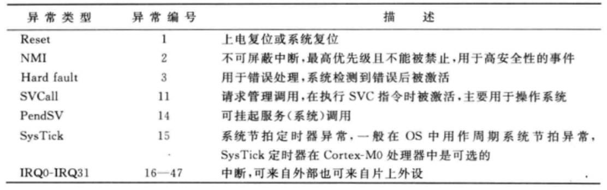

每一个异常都对应一个异常编号，这在包括IPSR在内的许多寄存器中都有所体现，而且这个异常编号还指明了异常向量的地址。需要注意的是，在设备驱动库中，异常编号和中断编号是相互独立的。系统异常使用负数定义，而中断则使用从0~31的正数定义。

复位是一类特殊的异常。如果发生复位的话，Cortex-M0处理器将会退出主程序，并且在线程模式中执行复位处理(不必从处理模式返回到线程模式)。另外，数值为1的异常号在IPSR中是不可见的。

## 嵌套向量中断控制器(NVIC)

为了管理中断请求的优先级并且处理其他异常，Cortex-M0处理器内置了嵌套向量中断控制器(NVIC)。NVIC的一些可编程寄存器控制着中断管理功能，这些寄存器被映射到系统地址空间里，它们所处的区域称为系统控制空间(SCS)。
NVIC 具有以下特性:

- 灵活的中断管理
- 支持嵌套中断
- 向量化的异常入口
- 中断屏蔽

## 系统控制块(SCB)

Cortex-M0具有多种调试特性， 包括停止模式调试、单步、寄存器访问，另有专用的调试模块提供断点单元(BPU)和数据监视点(DWT)单元，其中BPU支持最多4个硬件断点，DWT支持最多2个监视点。

调试接口单元可以使用JTAG协议，也可以使用串行线调试(SWD)协议。串行线调试接口与JTAG接口使用相同的引脚行时钟与JTAG的TCK信号复用，而串行线数据与JTAG的TMS信号复用。

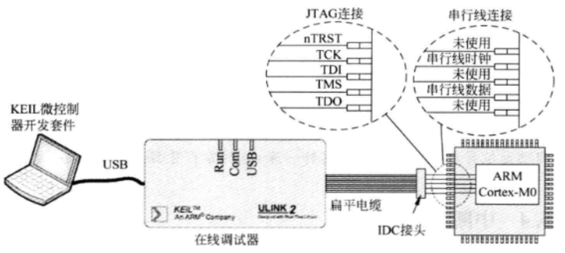

## 程序映像和启动流程

要理解Cortex-MO的启动流程，需要首先大致浏览一下程序映像。通常Cortex-MO处理器的程序映像是从地址0x00000000开始的。

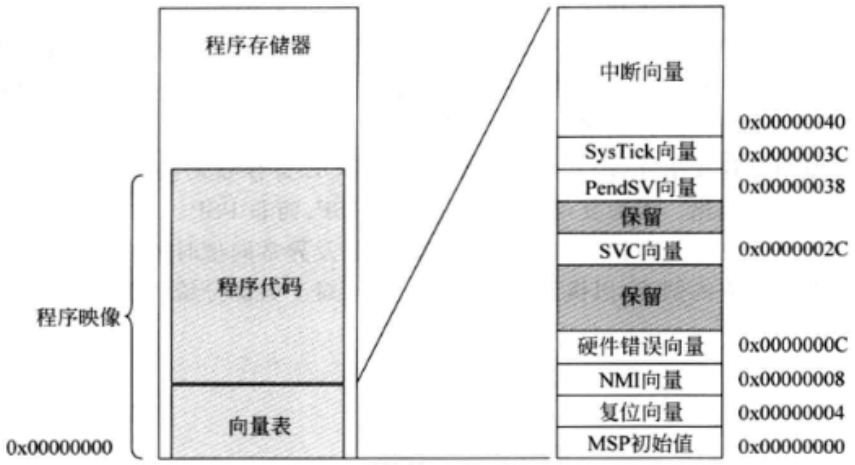

程序映像的开始处为向量表，其中包含了异常的起始地址(向量)，每个中断向量的地址都等于“异常号\*4”。例如，外部IRQ#0的异常类型为16，因此IRQ#0的向量地址为16\*4=0x40。这些向量的最低位都被置1表明异常处理执行时使用Thumb指令。向量表的大小由实际使用的中断个数决定。

向量表中还包含了主栈指针(MSP)的初始值，它存储在向量表的头四个字节。复位时，处理器首先读取向量表前两个字(即前8字节)第一个字为MSP的初始值，第二个字为复位向量，它表示程序执行的起始地址(复位处理)。

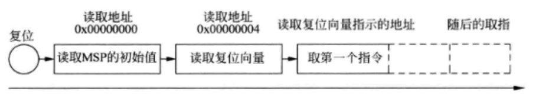

例如，如果启动代码位于地址0x000000C0，就需要在复位向量处写人这个地址，并且将地址的最低位置为1，以表明当前为Thumb代码。因此地址0x00000004处的值被置为0x000000C1。在取得复位向量值以后，处理器将开始从这个地址处执行程序代码。传统的ARM处理器(例如ARM7TDMI)在这方面的处理是不同的，它们往往从地址0x00000000处开始执行程序，而且向量表中为跳转指令，Cortex-M处理器中则是地址值。

复位流程也会初始化主栈指针(MSP)，假定内存位于0x2000000~0x20007FFF，可以将0x20008000写在地址0x0000000处，这样就实现了把主栈置于内存的顶部。

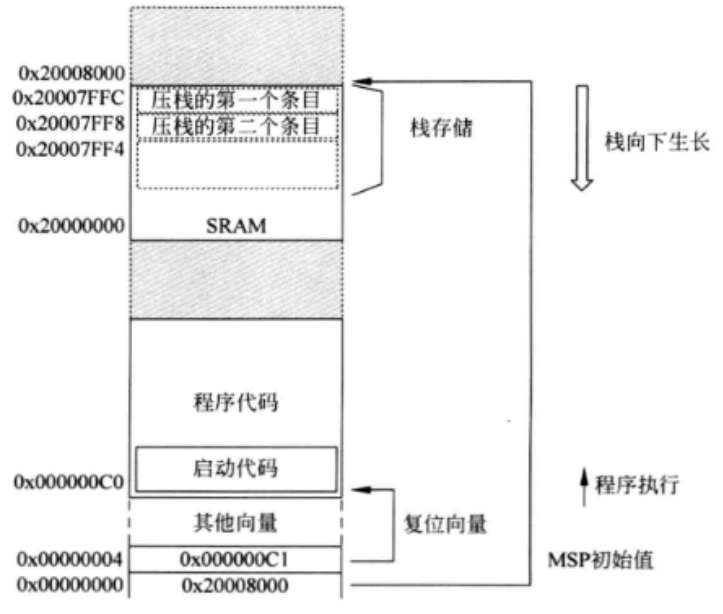

和Cortex-MO的固定地址栈指针初始化不同，传统的ARM处理器和其他许多微控制器都是通过软件初始化的方式来实现的。
如果要使用进程栈指针(PSP)，在配置CONTROL寄存器切换指针前，必须首先通过软件代码将其初始化。因为复位流程只初始化MSP，而非PSP。
