# 存储器系统

## 概述

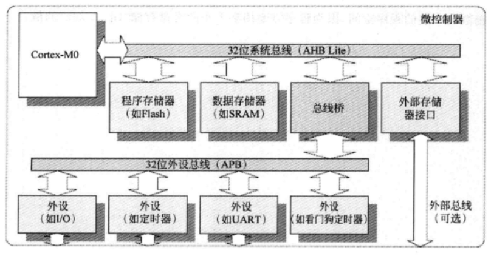

由于主总线系统和外设总线是相互分离的，而且有些情况下时钟频率控制也是不同的，应用程序在访问外设前可能需要初始化微控制器的时钟控制硬件。有些情况下，一个微控制器可能有多个外设总线段，并且每个段运行在不同的时钟频率下。除了可以让系统的某些部分运行在较低频率下以外，独立的总线段还可以停止某些外设系统的时钟，这样也就可能降低功耗了。

## 存储映射

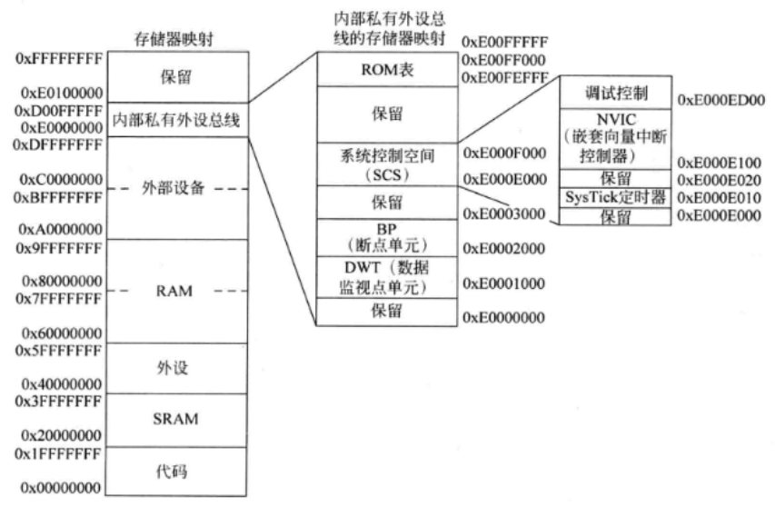

- 代码区域(0x00000000~0x1FFFFFFF)
  代码区域的大小为512MB，它主要用于存储程序代码，这其中也包括作为程序映像一部分的向量表，另外也可用作数据存储器(连接到RAM)。

- SRAM 区域(0x20000000~0x3FFFFFFF)

  SRAM 区域位于存储器映射的第二个512MB，它主要用于数据存储，这其中也包括栈它还可用于程序代码存储。例如，有些情况下，数据有可能需要从低速外部存储器复制到SRAM中并且在SRAM中执行程序。尽管该区域被命名为SRAM，实际的存储器也可以是SRAM、SDRAM或其他类型的设备。

- 外设区域(0x40000000~0x5FFFFFFF)
  外设区域的大小也为512MB，它主要用于外设以及数据存储。不过，外设区域中不允许执行程序。连接到该存储器区域的外设可以是AHB_Lite外设，也可以是APB外设(通过总线桥)。
  
- RAM区域(0x60000000~0x9FFFFFFF)
  
  RAM区域包括两个512MB的块，这样就得到了一个总共1GB的区域。这两个512MB存储器块主要用于数据存储，而且多数情况下RAM区域可使用1GB的连续存储器空间。RAM区域中还可以执行程序代码，这两个区域的唯一差异在于它们的存储器属性不同。如果设计中存在一个系统级的缓存(level-2缓存)这个差异就会带来缓存行为的差异。
  
- 设备区域(0xA0000000~0xDFFFFFFF)
  外部设备区域包括两个512MB的存储器块这样就能总共得到1GB空间。两个512MB块主要用于外设和 I/0，设备区域不允许程序执行，但可用作通用数据存储。同RAM区域类似，设备区域的两部分也有不同的存储器属性。
  
- 内部私有外设总线(PPB)(0XE0000000~0xEOOFFFFF)
  内部PPB存储器空间用于处理器内部的外设包括中断控制器NVIC和调试部件等内部PPB存储器空间的大小为1MB，而且这个区域内不允许执行程序。
  在PPB存储器区域中，有一段特殊的存储器区城被定义为系统控制空间(SCS)，其地址范围为 0xE000E000~0xE000EFFF。该区域内包括中断控制寄存器系统控制寄存器和调试控制寄存器等，NVIC寄存器也是SCS存储器空间的一部分。SCS中还包含一个可选定时器SysTick。
  
- 保留存储器空间(0xE0100000~0xFFFFFFFF)
  
  存储器映射的最后511MB为保留存储器空间，这段空间在某些微控制器中预留为供应商特定的用途。
  
  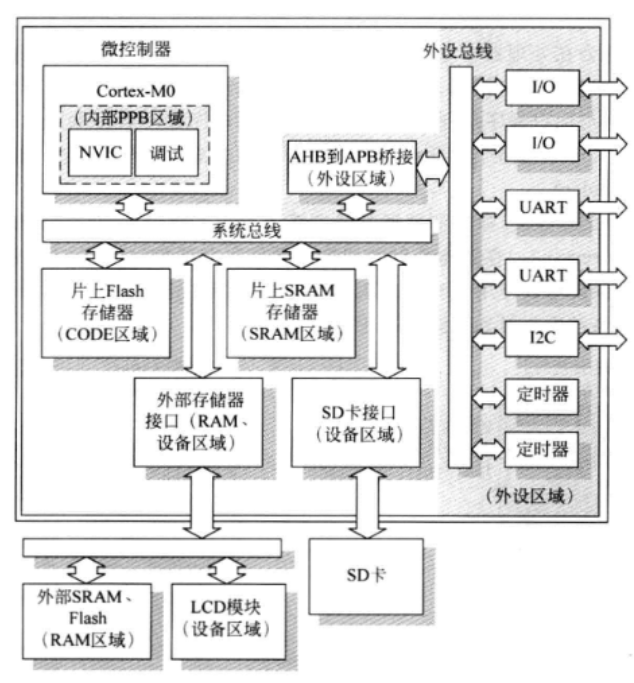

## 程序存储器，Boot Loader和存储器重映射

当 Cortex-MO处理器从复位中启动时，它会首先访问 0 地址的向量表，从而取得 MSP的初始值和复位向量，然后它就可以从复位向量开始执行程序。不过，在用户编程以前，现在市场上的微控制器产品的Flash存储器中可能没有任何程序。为了保证处理器可以正确地启动，有些基于Cortex-MO的微控制器含有一个Boot loader。

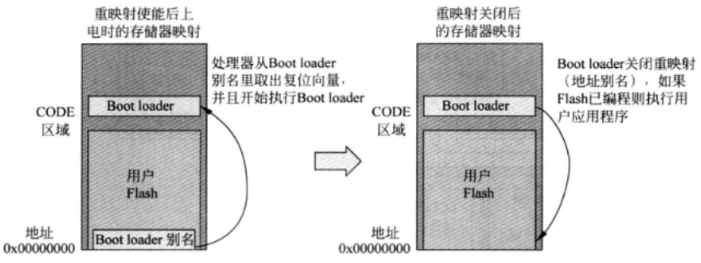

Boot loader可能还具有其他特性，比如硬件初始化(时钟和PLL设置)多种启动配置固件保护，甚至可以用作Flash擦除工具。系统总线上的存储器映射特性并不是Cortex-MO处理器的一部分，因此，不同微控制器供应商产品的设计不同。

ARM微控制器使用的另外一种重映射特性为，SRAM块可以重映射到地址0上。微控制器使用的非易失性存储器如Flsh等要比SRAM慢，如果微控制器运行在较高的时钟频率下，Flash存储器中的程序在执行时就会需要插入等待状态而将SRAM重映射到地址0后，程序就可以被复制到SRAM并以最快速度执行，这样会避免取向量表时出现等待，否则会增加中断等待的时间。

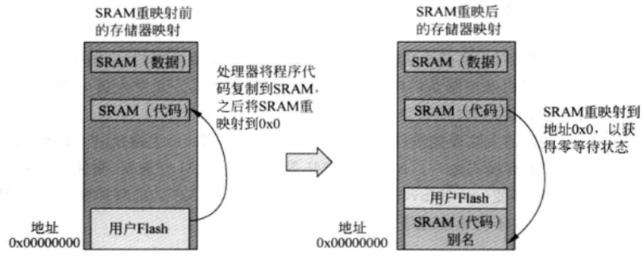

## 支持小端和大端

Cortex-M0处理器可以支持小端的存储器格式，也可以支持大端的。大小端在系统设计时由微控制器供应商选择，而软件不能修改。开发人员可以配置开发工具的工程选项，使其与目标微控制器相匹配。

小端:

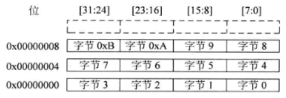

大端:

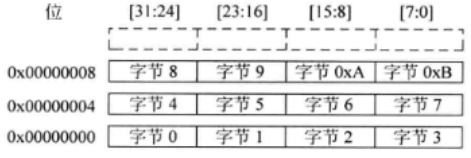

应该注意大端配置有两种例外:

1. 取指总是小端的
2. 对私有外设总线(PPB)的访问总是小端的

小端系统的数据访问:

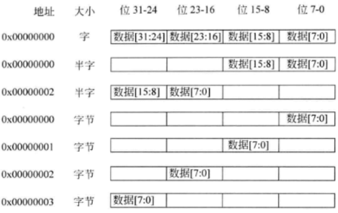

大端系统的数据访问:

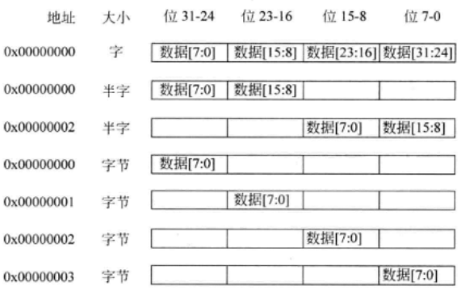

## 数据类型

- C语言开发中的常用数据类型

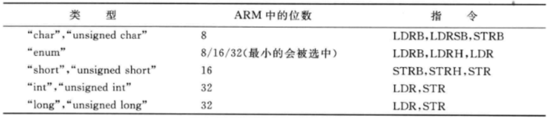

- C99中“stdinth”常用的数据类型

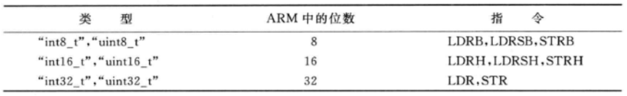

如果使用了其他宽度更大的数据类型(如int64_t，uint64_t)，C编译器会自动将这些数据传输转换为存储器访问指令。
应该注意的是，对于外设寄存器访问，使用的数据类型应该同硬件寄存器大小相匹配。要不外设可能会忽略此次传输，或者运行结果同预想的不一致。
多数情况下，连接到外设总线(APB)的外设应该使用字传输来访问。这是因为 APB协议没有定义传输宽度信号，所有的传输也就都被认为是字大小的。因此，通过APB访问的外设寄存器通常被声明为“volatile unsigned integer”。

## 数据对齐

Cortex-M0处理器支持的Thumb指令只能产生对齐访问这就意味着传输地址只能是传输大小的整数倍。例如，字传输只能访问0x0、0x4、0x8和0xC之类的地址，与此类似，半字访问只能访问0x0、0x2、0x4等地址，所有的字节访问则都是对齐的。

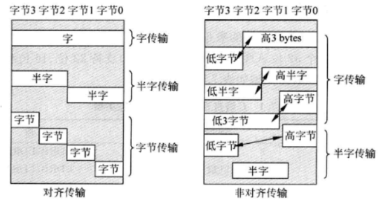

## 多寄存器加载和存储指令的使用

Cortex-M0处理器支持多寄存器加载和存储指令，如果使用正确的话，系统性能可以得到很大的提升。例如，它可以用于加快数据传输过程或者作为一种自动调整指针的方法。
在处理外设访问时，需要避免使用LDM或STM指令，如果Cortex-M0处理器在LDM或STM指令执行期间收到一个中断请求，LDM或STM指会被放弃并且中断服务程序会开始执行。在中断复位结束时，程序会返回到中断的LDM或STM指并且重启中断的LDM或STM的第一次传输。

由于这种重启机制，中断的LDM或STM指令中的有些传输可能会执行两次。这对于通常的存储器设备不是一个问题，而如果访问的是一个外设，这种重复传输则可能会引起错误。例如如果LDM指用于从先入先出(FIFO)缓冲中读取数据，FIFO中的有些数据可能就会因为这种重复而丢失。
作为预防措施，应该避免在外设访问时使用LDM或STM指令。除非能够确信重启行为不会对外设引起错误操作。

## 存储器属性

在ARMv6-M架构中，不同的存储器区域可以定义多种存储器访问属性:

- 可执行(executable)

  这是个公用属性，它定义了程序是否允许在存储器区域中执行。根据ARM文档，如果一个存储器区域是不可执行的，它就会被标记为 eXecuteNever(XN，永不执行)。

- 可缓冲(bufferable)
  
  在一个可缓冲存储器区域上执行数据写操作写传输可能会被缓存起来，这就意味着处理器不必等待当前的写传输完成，就可以继续执行下一条指令。
  
- 可缓存(cacheable)
  如果系统中含有缓存设备，它可以在本地备份当前传输的数据，并可以下次在访问相同的存储器位置时重新使用，这样可以加速系统执行。缓存设备可以是一个缓存存储器单元，也可以是存储器控制器中的一个小的缓存。

- 可共享(shareable)

  可共享属性定义了多个处理器是否可以访问公用存储器区域，如果一块存储器区域是可共享的，存储器系统需要确保多个处理器访问这一区域时的一致性。

基于这些存储器属性，处理器架构上定义了多种类型的存储器，以及每个存储器区城可以使用哪种类型的设备:

- 普通存储器

  普通存储器可以是可共享的也可以是不可共享的，可以是可缓存的也可以是不可缓存的。对于可缓存的存储器，缓存行为可以分为写通(WT)以及写回写分配(WBWT)。

- 设备存储器
  
  设备存储器为不可缓存的，它们可以是可共享的，也可以是不可共享的。
  
- 强序(Strongly-ordered)存储器

  这种存储器是不可缓存以及不可缓冲的，对强序区域的读写操作会立即起作用。另外，在这种存储器接口的传输顺序必须和相应的存储器访问指令的顺序一致(速度优化也不会调整访问顺序，Cortex-MO 不具有访问重排序特性)。强序存储器区域总是可共享的。

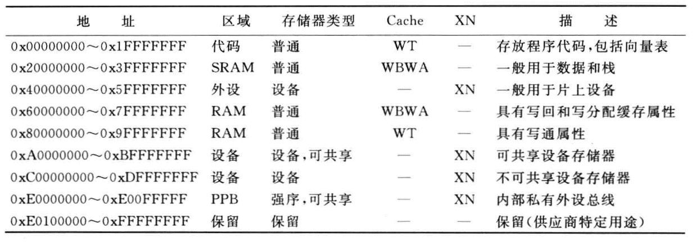

PPB存储器区域被定义为强序属性(SO)，这就意味着存储器是不可缓存和不可缓冲的。对于 Cortex-M0，在强序区域访问结束之前，后面的操作不会执行。这种处理适用于修改系统控制空间(SCS)的寄存器，此时一般希望在下一条指令执行前，对寄存器的修改操作会立即执行。