# 异常和中断

## Cortex-M0处理器的异常类型

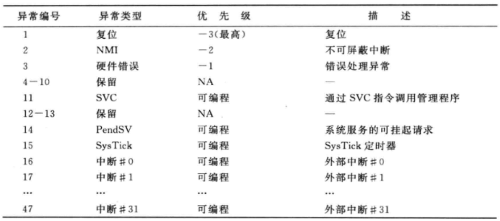

- SVC(请求管理调用)

  SVC指令执行时就会产生SVC异常，其通常用在具有操作系统的系统中，为应用程序提供了访问系统服务的入口。

- PendSV(可挂起的系统调用)

  PendSV是用于带OS(操作系统)的应用程序的另外一个异常，SVC异常在SVC指令执行后会马上开始，PendSV在这点上有所不同，它可以延迟执行，在OS上使用PendSV可以确保高优先级任务完成后才执行系统调度。

- 系统节拍

  NVIC中的SysTick定时器为OS应用可以利用的另外一个特性。几乎所有操作系统的运行都需要上下文切换，而这一过程通常需要依靠定时器产生定时中断来完成。Cortex-MO处理器内集成了一个简单的定时器，这样就使得设备间移植操作系统更加容易。在微控制器应用中SysTick定时器是可以选配的。

## 异常优先级定义

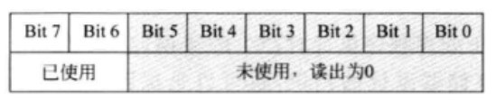

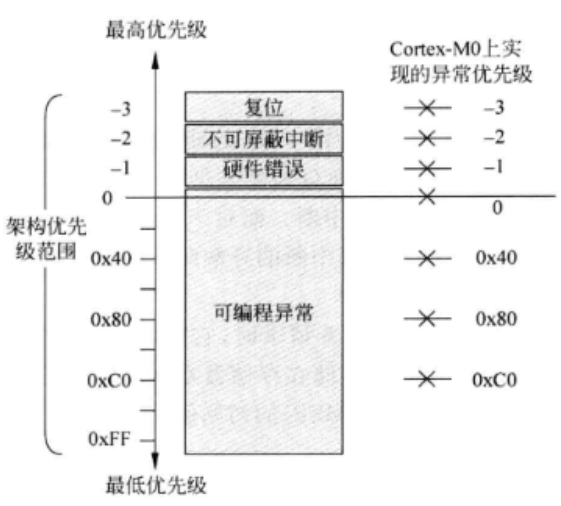

## 向量表

当Cortex-MO处理器要处理中断服务请求时，它需要首先确定异常处理的起始地址，所需的信息叫做向量表，它存储在存储器空间的开始位置。向量表包含了系统中可用异常的异常向量，以及主栈指针(MSP)的初始值。

异常向量的存储顺序同异常编号一致，由于每个向量都是1个字(4字节)异常向量的地址为异常编号乘4。每个异常向量都是异常处理的起始地址，而且其最低位置1，表明异常处理为Thumb代码。

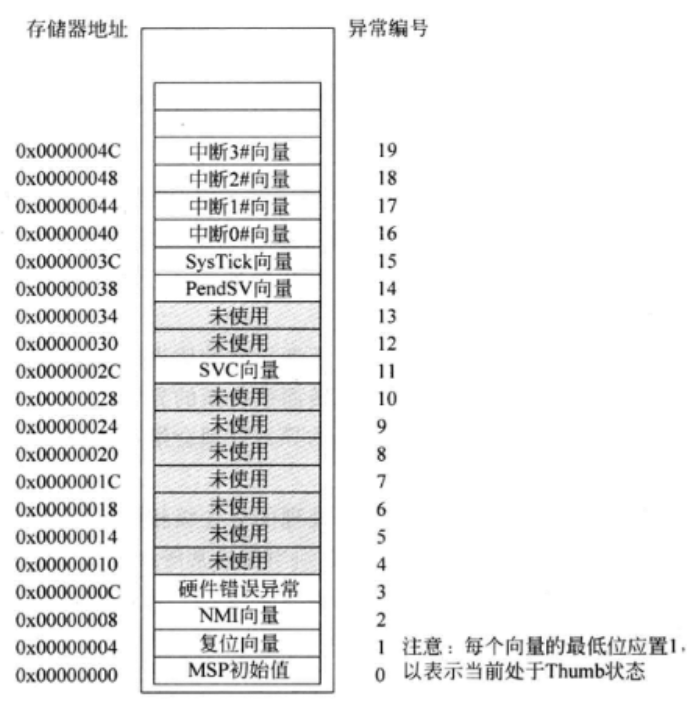

## 异常流程概述

### 接受异常请求

处理器要接受一个异常，需要满足以下条件:

- 对于中断和SysTick中断请求中断必须使能。
- 处理器正在执行的异常处理的优先级不能相同或更大。
- PRIMASK中断屏蔽寄存器没有屏蔽掉异常。应该注意的是，对于SVC异常，如果用到SVC指令的异常处理的优先级与SVC异常本身相同或者更大，这种情况就会引起硬件错误异常处理的执行。

### 压栈和出栈

当Cortex-M0处理器接受了一个异常以后，寄存器组中的一些寄存器(RO到R3，R12和R14)、返回地址(PC)以及程序状态寄存器(xPSR)会被自动压入当前栈空间里。链接寄存器(LR/R14)则会被更新为异常返回时使用的特殊值(EXC_RETURN)，然后异常向量被自动定位而且异常处理开始执行。

异常处理过程执行到最后时，将会利用执行特殊值(EXC_RETURN)来触发异常返回机制。处理器还会查看当前是否还有其他异常需要处理，如果没有，处理器就会恢复之前存储在栈空间的寄存器值，并继续执行中断前的程序。

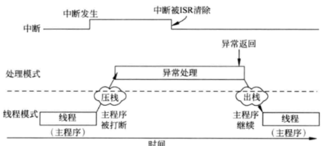

### 异常返回指令

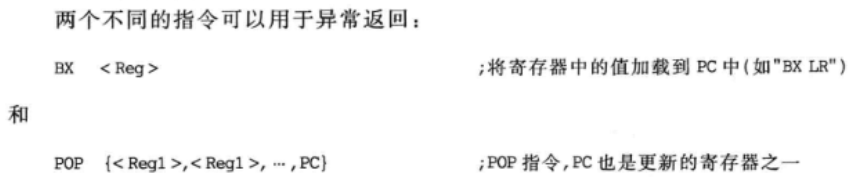

当其中的一个指令执行，而且EXC RETURN特殊值被加载到程序计数器(PC)中时异常返回机制就会启动。如果加载到PC的值不是EXC_RETURN，则其会被当做普通的BX或POP指令。

### 末尾连锁

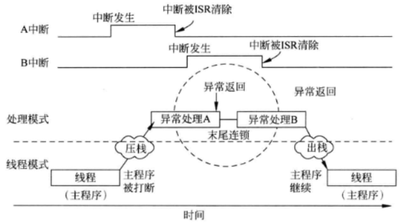

### 延迟到达

延迟到达(Late arrival)是Cortex-MO的优化机制它可以加快高优先级异常的处理如果在低优先级异常压栈过程中发生了高优先级异常，处理器就会首先处理高优先级异常。

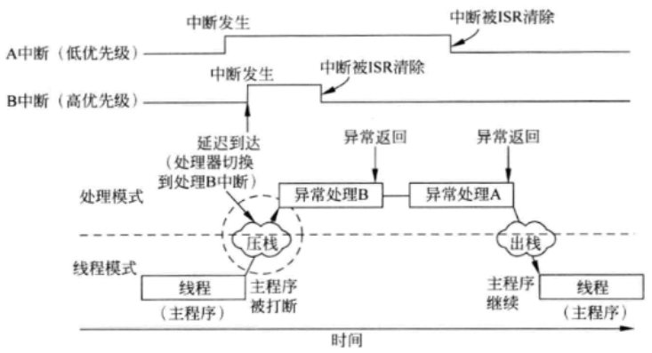

由于每个中断都需要同样的压栈操作，后至的高优先级中断发生后将会继续之前的压栈过程。压栈完成后，高优先级的异常向量就会被取出以替代低优先级的那个。

如果没有延迟到达优化，在低优先级异常开始时，处理器就必须抢占并且重新进入异常处理流程，这样会带来较长的延迟以及较大栈空间的使用。

## EXC_RETURN

EXC_RETURN为架构定义的特殊值，用于异常返回机制，这个值在异常被接受并且乐栈完成后会自动存储到链接寄存器中(LR或R14)。EXC RETURN为32位数值并目高28位置1，第0位到第3位则提供了异常返回机制所需的信息。

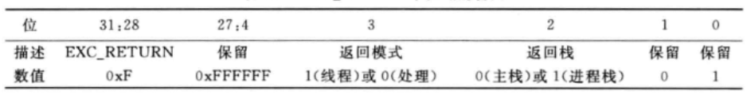

EXC_RETURN的合法值:

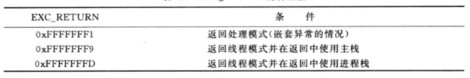

如果线程正在使用主栈(CONTROL寄存器的第1位为0)在进第一个异常时LR的值被置为0xFFFFFFF9，而进入嵌套异常时则为0xFFFFFFF1这种情况可以参考如下:

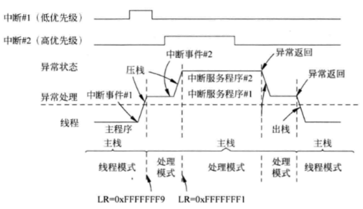

如果线程使用进程栈(CONTROL寄存器的第1位置1)，在进第个异常时，LR的值被置为0xFFFFFFFD，而进入嵌套异常时则为0xFFFFFFF1，这种情况可以参考如下:

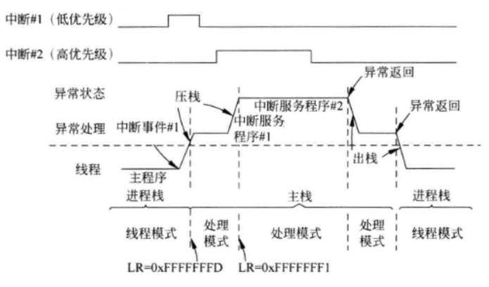

## 异常入口流程的细节

当异常发生时，以下的情况会随之发生:

- 压栈并且栈指针更新
- 处理器取出异常向量并且将其写入PC
- 存器更新(LRIPSR和NVIC寄存器)

### 压栈

对于嵌套异常，压栈时总是使用主栈，因为处理器当前处于处理模式，这种情况下只能使用主栈。
将寄存器RO-R3、R12、PC、LR和XPSR保存到栈中的原因是，这些寄存器被称为“调用者保存寄存器”。

压栈时保存到栈里的数据被统称为“栈帧(stack frame)”在 Cortex-MO处理器中，一个栈帧总是双字对齐的，这样就能确保栈的使用遵循AAPCS标准。如果上一个压入的数据可能会处于非双字对齐的，压栈机制就会将压栈的位置自动调整到下一个双字对齐的地址上并且在栈中的xPSR寄存器中设置标志(第9位)表明发生了双字栈调整。

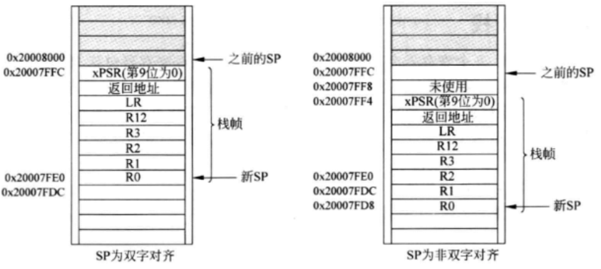

在出栈过程中，处理器会检查栈中的xPSR的标志，并且根据标志的不同对指针做出相应的调整。

当压栈结束后，栈指针会得到更新，并且主栈指针会被选择为当前栈指针(处理模式总是使用主栈)，然后异常向量也会被取出。

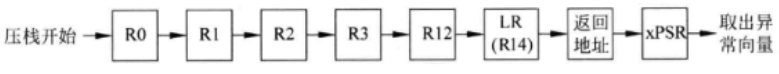

### 取出向量并更新PC

压栈完成以后，处理器会从向量表中取出异常向量，然后将向量写到 PC，并且将从这个地址中开始异常处理的取指。

### 寄存器更新

异常处理开始执行后，LR的值会被更新为相应的EXC RETURN值，这个值将会被用作异常返回，IPSR 也会被更改为当前处理异常对应的异常编号。

另外，NVIC的许多寄存器也可能会更新，其他的寄存器还包括异常为中断时外部中断的状态寄存器，或者为系统异常时对应的中断控制和状态寄存器。

## 异常退出流程的细节

当执行异常返回指令时(使用POP或者BX指令将EXC_RETURN加载到PC)，异常退出流程就开始了，这个过程可能包括以下步骤:

- 寄存器出栈。
- 恢复返回地址，取出并执行。

### 寄存器出栈

为了将寄存器的值恢复到异常发生以前的状态，需要使用POP将压栈过程中保存在栈的值取出，并恢复至相应的寄存器中。由于可以保存在主栈或者进程栈中，处理器会首先检查正在使用的EXC_RETURN 的值。如果EXC_RETURN的第2位为0，处理器就开始从主栈中进行出栈操作;如果该位为1，则从进程栈中进行。

出栈完成后，栈指针需要调整。在压栈时，为了使栈为双字对齐的，栈空间里可能包含了4字节的空隙。在这种情况下，栈中的xPSR的第9位为1这样SP的值也应相应地去掉4字节的空隙。
另外，如果EXC_RETURN的第2、3位为1这就表明异常退出将返回线程模式，当前的SP也应切换回进程栈。

### 从返回地址取值并执行

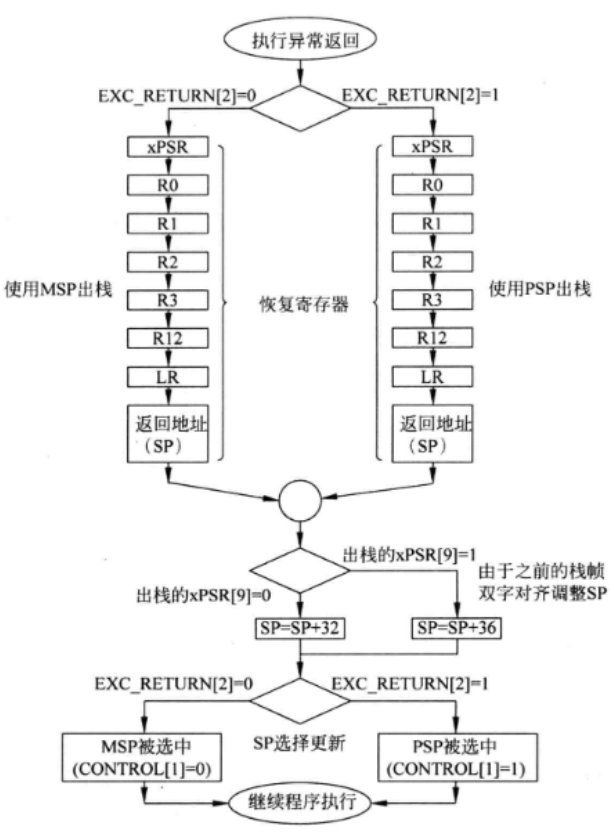
