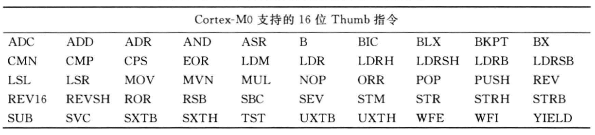
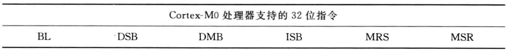
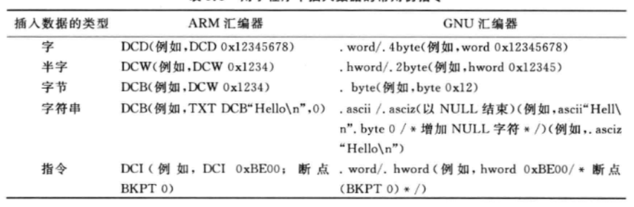
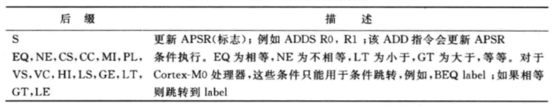
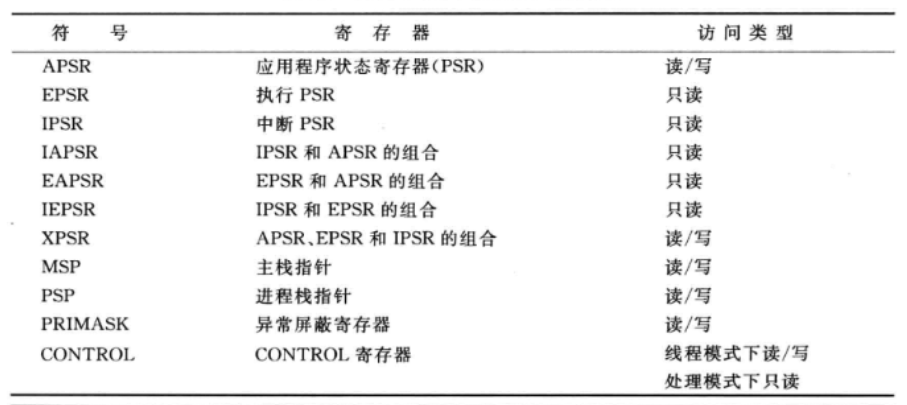
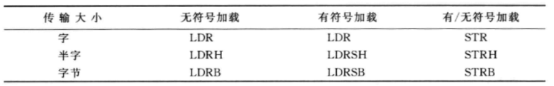

# 指令集

## Cortex-M0指令集

## 汇编基础

不同的开发工具供应商(例如GNU工具链)的汇编工具的语法不同。大多数情况下，汇编指令的助记符是相同的，而在编译伪指令、定义、标号和注释等方面可能会有所不同。

### 后缀的使用

对于ARM处理器的汇编器，有些指令后可以加上后缀。

### UAL

一般说来，对处于Thumb状态下的ARM处理器编程就要依据Thumb汇编语法为了提高架构间的可移植性，统一不同架构间的汇编语言语法，ARM开发工具已支持统一汇编语言(UAL)。对于过去使用 ARM7TDMI的用户来说，最明显的区别如下:

- 即便目的寄存器为源寄存器之一，有些数据操作指令还是使用三个操作数。过去(应用UAL之前)同样的指令在语法上可能只使用两个操作数。
- “S”后缀变得更加明确，过去，把一个汇编程序改为Thumb指令时，大多数的数据操作指令默认都会影响APSR，因此就不必使用“S”后缀了。根据UAL语法，影响APSR寄存器的指令都应该使用“S”后缀，以明确期望的操作，这样可以防止在不同架构间移植程序代码时出现错误。

### 指令列表

根据功能可以将 Cortex-MO 处理器的指令划分为以下几组:

- 在处理器内移动数据

  特殊寄存器访问，会用到MRS和MSR指令。

  

- 存储器访问

  

  > 进行存储访问时，应确保地址是对齐的。例如，执行字访问需要操作地址的最低两位为0，半字访问则需要操作地址的最低位为0。Cortex-MO 处理器不支持非对齐访问，任何在非对齐地址上的尝试都会导致硬件错误异常。字节传输在 Cortex-MO 上总是对齐的。

- 栈空间访问

- 算术运算

- 逻辑运算

- 移位和循环操作

- 展开和顺序反转操作

- 程序流控制(跳转、条件跳转和函数调用)

- 存储器屏障指令

- 异常相关指令

- 其他功能
